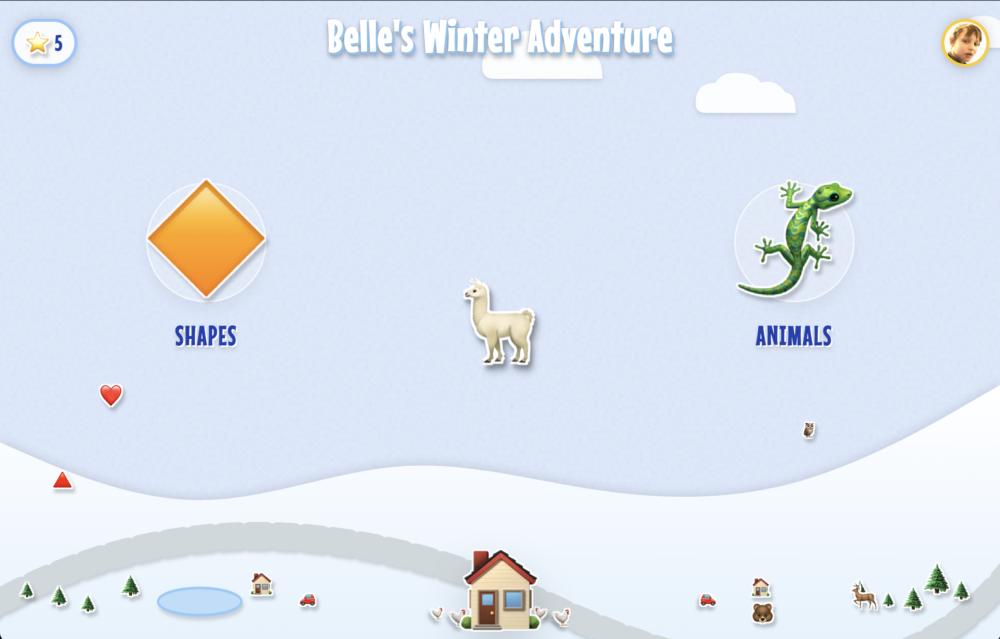

# ❄️ Belle's Winter Adventure

## 📖 Project Overview
**[Belle's Winter Adventure](https://joefromdenver.github.io/belles-winter-adventure/)** is a developmentally appropriate Progressive Web Application (PWA) designed for a 30-month-old toddler. It combines "science-backed" interaction design (fine motor skill calibration, immediate contingency feedback, and scaffolding) with a local theme (Wisconsin Christmas 2025 with family).

### The "Science-Backed" Approach
To ensure the experience is beneficial and "not mindless," the core game mechanics were selected to specifically target developmental milestones. **We prioritized complex "drag-and-drop" interactions over simple tapping to promote embodied cognition and fine motor planning, while the primary loop reinforces categorization skills (sorting by attribute) which are critical for this age group.**

### The Development Journey
This project represents a rapid, iterative development cycle driven by real-world playtesting feedback:
* **Research Phase:** Analysis of neurological capabilities of a 2.5-year-old (symbolic representation, "video deficit" mitigation).
* **Initial Release (v1.0):** Single-file HTML/JS sorting task featuring custom family avatars.
* **The "Papercraft" Evolution (v2.0+):** UI overhauled into a high-contrast "Paper Mario" aesthetic to improve visibility and engagement.
* **Dynamic Expansion:** Engine upgraded to support randomized categories (Faces, Animals, Food, Vehicles) and procedural environments.

---

## 📜 Changelog

### Version 2.1.3 (Current)
* **Polish:** Reduced category zone size by 10% for better screen real estate.
* **Polish:** Lowered maximum ground decoration height to 15% to match terrain.
* **Fix:** Hide active item when entering Parent Mode to prevent UI obstruction.

### Version 2.2 (The Stability Update)
* **CRITICAL:** Refactored drag physics to use `transform: translate3d`.
    * Fixes "Scale Feedback Loop" bug where items drifted left/up on tap.
    * Decoupled visual scale animations from logical coordinate system.
* **Fix:** Attempted fix for drag drift using center-point calculation.

### Version 2.1 (The Papercraft Update)
* **VISUAL OVERHAUL:** Implemented Papercraft Aesthetic.
    * Added global noise texture overlay.
    * Applied white borders and drop shadows to all emojis.
    * Converted background elements to HTML layers for aspect ratio preservation.
* **UX:** Implemented "Instant Success" trigger on drop (removed delay).
* **UX:** Added "Forgiving Drag" logic (400ms grace period on touch loss).
* **Feature:** Added "Chicken Coop" decoration (7 chickens) when Animals active.

### Version 2.0 (Dynamic Categories)
* **Feature:** Dynamic Backgrounds. Scenery now changes based on active categories (e.g., Lake for Animals, Airport for Vehicles).
* **Feature:** Snowstorm Event. Random heavy snow triggers every 3-6 minutes.
* **Feature:** Parent Mode 2.0.
    * Added Category Config UI (Left/Right selection).
    * Added Blocklist functionality (tap emoji to ban).
    * Prevented selecting the same category on both sides.
* **Assets:** Added Nature (Outside) and Shapes categories.
* **Polish:** Connected rainbow emojis in background to form double arch.
* **Fix:** Swapped Lion 🦁 for Lizard 🦎 as Animal icon.
* **Fix:** Removed scary faces (skulls) from Smiley pool.

### Version 1.5 (Refinements)
* **Feature:** Replaced "Box" with "House" emoji + Doorbell sound.
* **Feature:** Strict Parent Mode. Requires 5s hold on Star+Angel with exactly 2 touch points (anti-palm).
* **Feature:** Implemented "Vacuum" success animation (Pop -> Spin -> Shrink).
* **Polish:** Increased gravity radius for drop zones to 250px.
* **Polish:** Increased confetti particle count to 60.

### Version 1.2 (Audio & Physics)
* **Audio:** Switched to Additive Synthesis (3-oscillator triangle wave) for "Wooden Purr" to fix mobile audio issues.
* **Audio:** Added global `touchstart` listener to unlock WebAudio API on iOS.
* **Physics:** Added invisible screen boundaries to prevent throwing items off-screen.
* **Physics:** Implemented circular, oversized hitboxes for toddler fine-motor variance.
* **Polish:** Items now stay in place for 3s after drop before resetting.

### Version 1.1 (The "Beau" Update)
* **Feature:** Added `beau.png` support for Angel icon with fallback.
* **Feature:** Added "Christmas Pickle" easter egg logic (Speech bubble vs Alert).
* **Polish:** Centered game title and added drop shadow.

### Version 1.0 (Initial Release)
* **Feature:** Smart Spawning. Items calculate safe landing Y-pos based on screen aspect ratio.
* **Visuals:** Added organic horizon SVG (curved snow, trees, lake).
* **Audio:** Implemented "Magical Hum" and "Fanfare" synths.
* **Logic:** Added "Success Lock" to prevent double-triggering sounds/spawns.

### Version 0.0 (Inception: The Concept)

**The Original Prompt:**
> My name is Joe. My wife Richelle and I are visiting family in Wisconsin for Christmas and I'd like to make a game for our 2 /12 year old niece Belle. There are only a few requirements.
>
> 1. It needs to be simple enough to entertain her on a phone or iPad screen, but it cannot be mindless. The core game loop must be science backed as educational and/or beneficial to the development of a girl her age.
> 2. It must be simple enough to be hosted on GitHub pages like my other recent game which can be installed as an app.
> 3. It needs to be touch centric and launch in "parent mode" which takes over as much screen input as possible so Belle can't accidentally quit it easily (she likes to mash things). Settings and controls (if needed) should be triggered by a hard to accidentally trigger method like long pressing with 3 fingers.
> 4. The theme needs to incorporate one or more of her favorite things like dinosaurs (from Dinosaur Ranch), Minnie Mouse, Christmas in Wisconsin, the main characters from Cars the TV series, or her 10-year old brother Beau.

**The Research Framework:**
The project began with a technical specification analyzing the neurological capabilities of a 30-month-old to justify specific mechanics:

* **Neurological Milestones:** At 30 months, children are in a rapid phase of synaptic pruning. The game targets **Symbolic Representation** (understanding objects can be grouped by attributes) and **Categorization** (Dino vs. Ornament), which validates their emerging worldview.
* **The "Tap vs. Drag" Debate:** Research indicates that while tapping is often a "ballistic" or reflexive action for toddlers, **Dragging** engages "embodied cognition." To drag an object, the child must Plan, Inhibit (don't lift the finger), and Monitor. This results in higher retention and mathematical reasoning skills compared to simple tapping.
* **Immediate Contingency:** To mitigate the "Video Deficit" (where toddlers learn less from screens), the game must provide immediate (<500ms) feedback. Responsiveness bridges the gap between digital and physical cause-and-effect.
* **Parent Mode Architecture:** To handle the requirement for input hegemony, the game utilizes a "Triple-Finger Hold" trigger (anatomically difficult for toddlers) and aggressive `touch-action: none` CSS to prevent OS gestures like "swipe back" or "overscroll rubber-banding."
